# shopgame chạy trên PHP version 7.3.3 và port:8000

### Bài tập này em cho project chạy trên Xampp và viết trên Visual Studio Code
#### Bài làm có sử dụng kỹ thuật Ajax thuần và file .htaccess

## Một số hình ảnh demo bài tập
## 1.Hiện danh sách sản phẩm Game
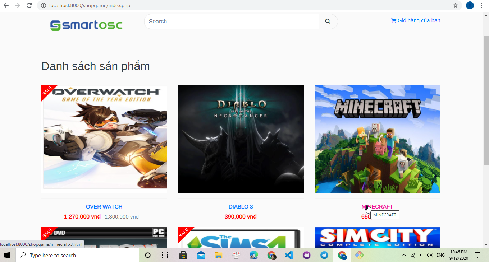
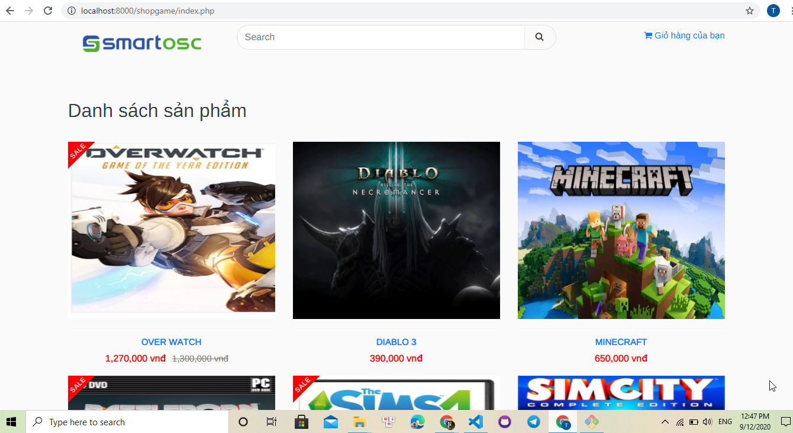
## 2.Hiện chi tiết sản phẩm Game
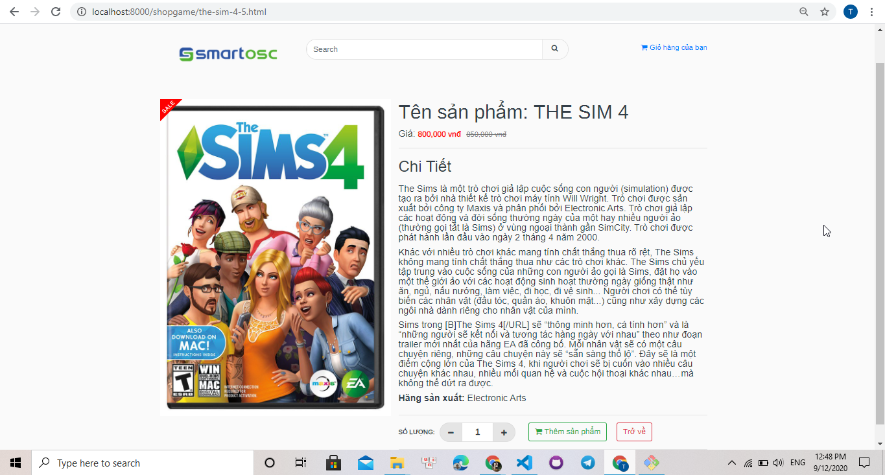
## 3.Hiện trang Login
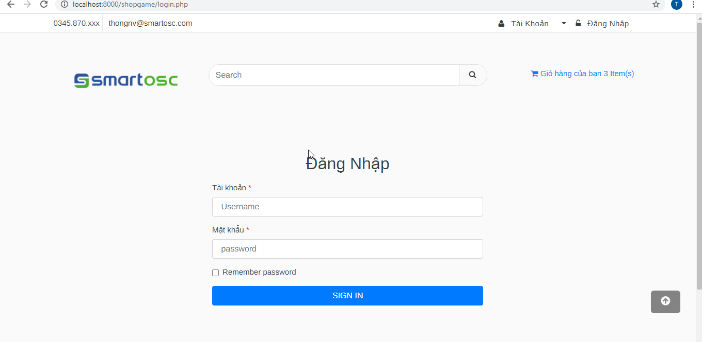
## 4.Hiện trang Admin
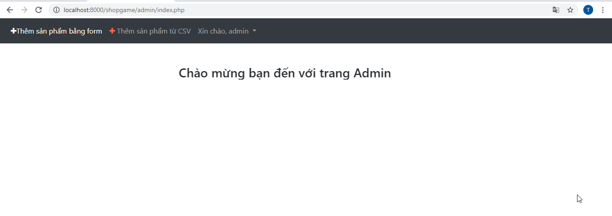
## 5.Hiện trang thêm sản phẩm bằng form
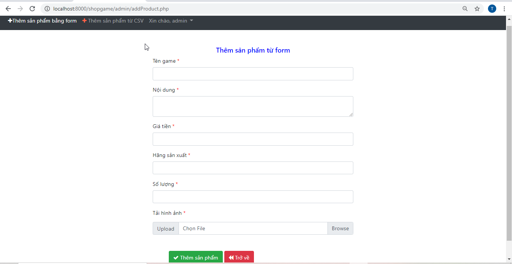
## 6.Hiện trang thêm sản phẩm bằng file CSV
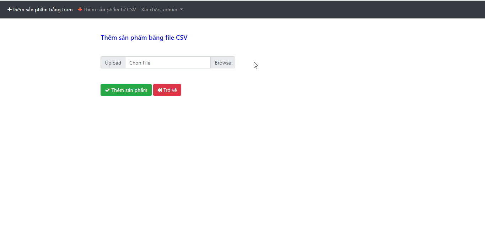
## 7.Thêm sản phẩm vào giỏ hàng
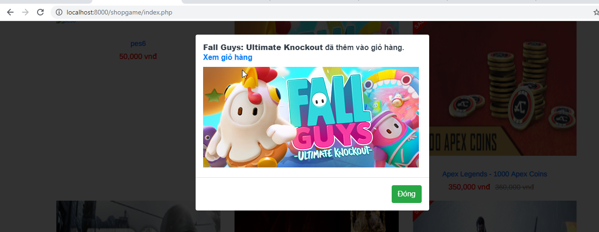
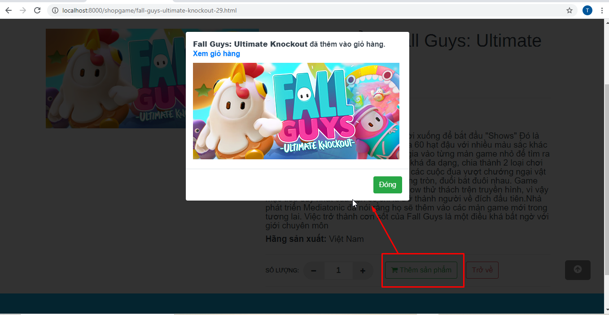
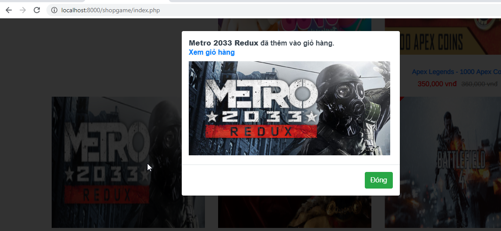
## 6.Hiện số lượng sản phẩm đã mua trên giỏ hàng
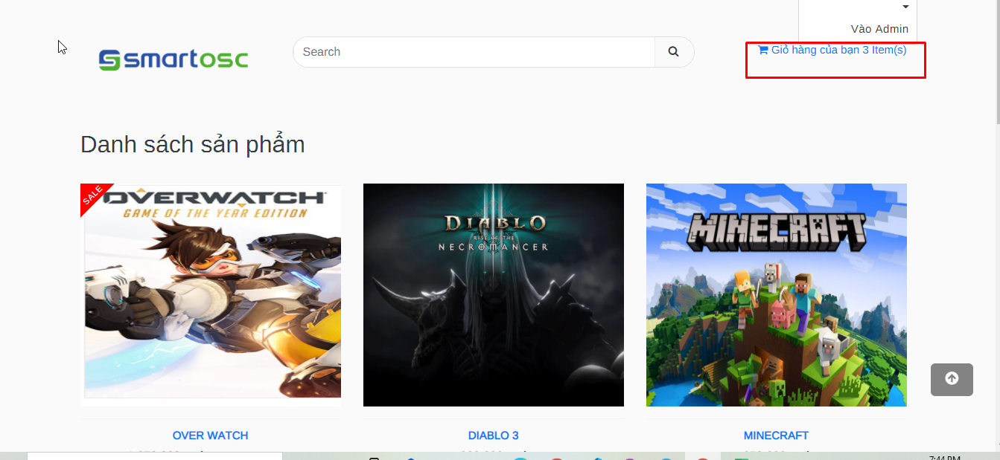
## 6.Hiện trang giỏ hàng
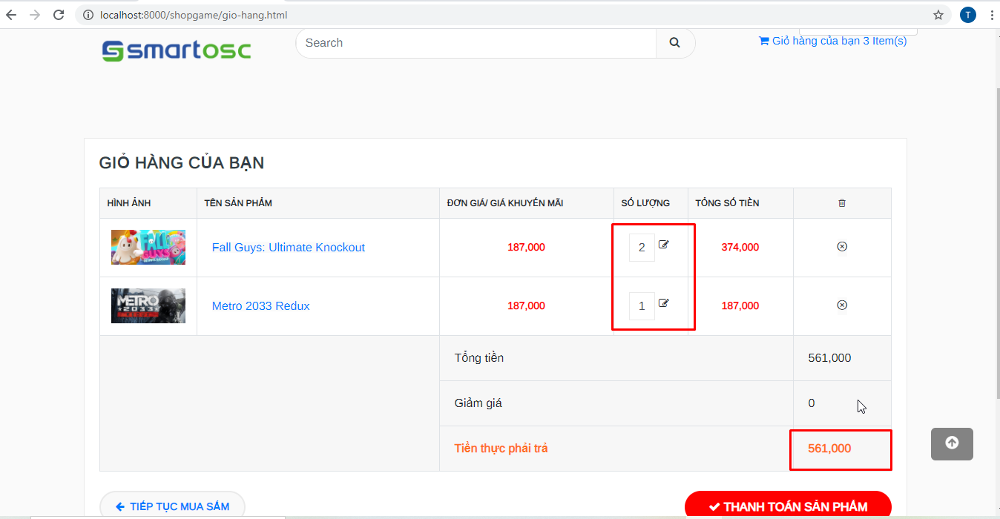

